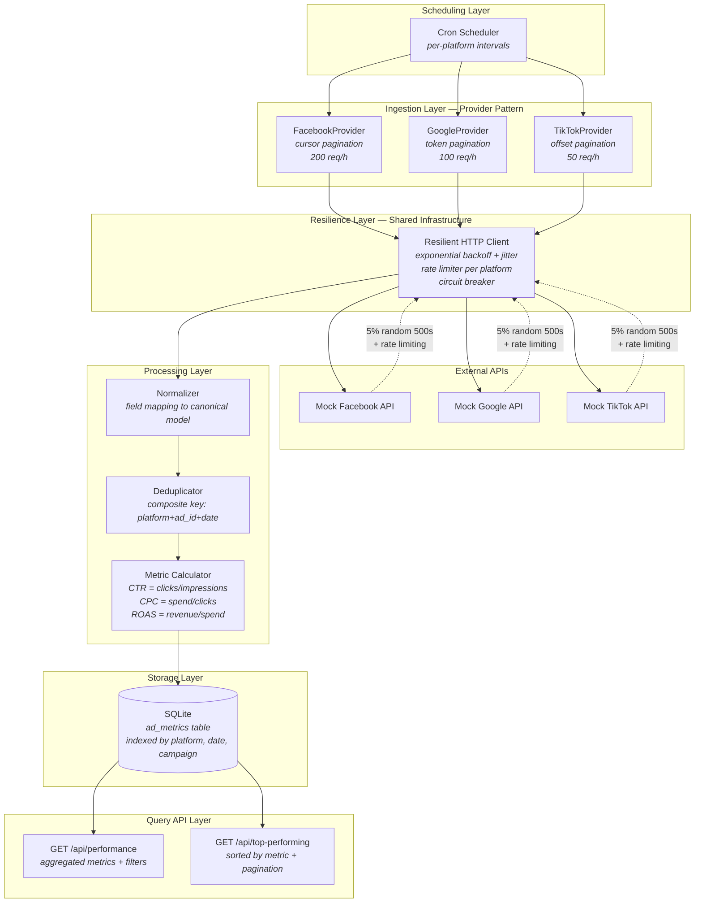
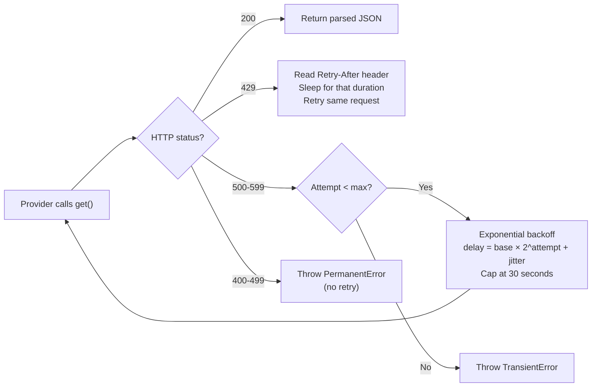
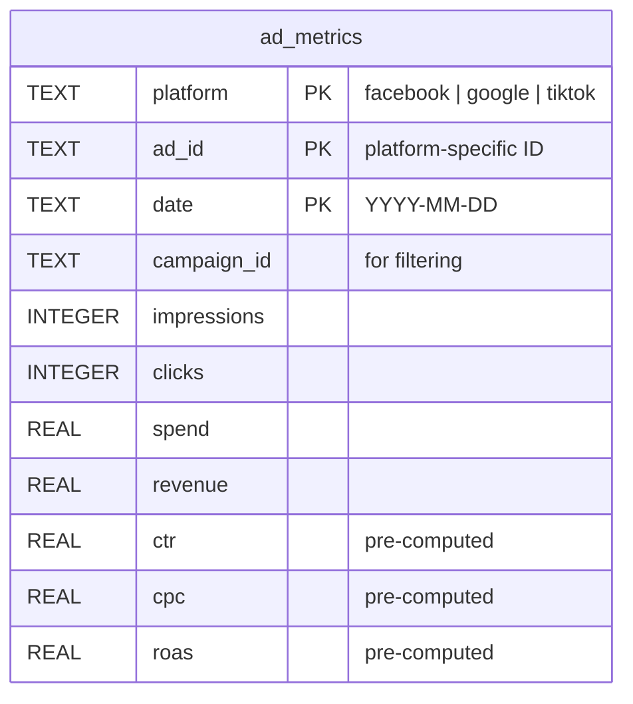

# Part 1 — System Design

## Architectural Approach: Pragmatic Ports & Adapters

The core complexity of this system is **not** in the business domain — computing CTR, CPC and ROAS is trivial arithmetic. The complexity lives in **integrating with three external APIs** that differ in pagination, authentication, rate limits, field naming, and response structure, while handling transient failures gracefully.

This observation drives the entire architecture: instead of applying a full Clean Architecture or DDD approach (which would add ceremony around a near-trivial domain), we use a **pragmatic ports-and-adapters** structure that concentrates design effort where the real problems are — the provider layer and the resilience layer.

## System Architecture



## Why This Structure and Not Another

### Why not DDD?

DDD exists to manage **complex domain logic** — invariants across aggregates, domain events triggering business processes, bounded contexts separating conflicting models. Here, the entire domain is three arithmetic operations on immutable records. There are no aggregates to protect, no domain events to emit, no ubiquitous language to align a team around. Applying DDD would signal that we don't know when *not* to use a pattern.

### Why not full Clean Architecture?

Clean Architecture's four layers (entities → use cases → adapters → frameworks) earn their weight when the domain layer has substantial logic worth isolating. In this system, a "use case" like `FetchPlatformData` does: call provider, receive data, save to store — three lines of orchestration. The use case layer becomes a pass-through that adds indirection without adding value. Every minute spent on that ceremony is a minute not spent on retry logic and pagination handling, which is what the evaluator actually examines.

### Why not full Hexagonal?

The hexagonal *concept* (ports and adapters) is exactly right — we apply it. But the full ceremony of primary ports, secondary ports, primary adapters, secondary adapters, and application services adds structural overhead that a 2-6 hour exercise doesn't justify. We take the useful idea (interfaces as contracts, implementations as adapters) without the taxonomy.

### What we actually use

**Pragmatic Ports & Adapters**: interfaces where they solve a real problem (provider extensibility, storage swappability, testability), plain functions and types everywhere else. The folder structure maps to responsibilities, not to architectural layers:

```
src/
├── providers/         # One file per platform + shared interface
│   ├── types.ts       # PlatformProvider interface
│   ├── facebook.ts
│   ├── google.ts
│   └── tiktok.ts
├── services/          # Orchestration logic
│   ├── ingestion.ts   # fetch → normalize → deduplicate → save
│   └── metrics.ts     # query aggregation + top-performing
├── storage/           # Persistence abstraction + implementation
│   ├── types.ts       # MetricStore interface
│   └── sqlite.ts      # SQLite implementation
├── api/               # HTTP layer (Express handlers)
│   └── routes.ts
├── shared/            # Cross-cutting concerns
│   ├── http-client.ts # Resilient HTTP with retry + rate limiting
│   ├── types.ts       # AdMetric type, Platform enum
│   └── logger.ts
└── main.ts            # Composition root — wires everything
```

## Key Design Decisions

### 1. Provider interface with AsyncGenerator (not abstract class)

```typescript
interface PlatformProvider {
  readonly platform: Platform;
  fetchMetrics(range: DateRange): AsyncGenerator<AdMetric[]>;
}
```

**Why interface over abstract class:** the three platforms don't share execution flow. Facebook iterates by campaign ID, then paginates within each. Google paginates directly. TikTok uses numeric offset. A template method in an abstract class would force artificial hooks (`getInitialCursor()`, `shouldIterateCampaigns()`) to accommodate differences that are better expressed as independent implementations.

**Why AsyncGenerator:** each `yield` emits one page of normalized metrics. The consumer (`ingestion.ts`) processes pages as they arrive without caring about pagination mechanics. Back-pressure is built in — the generator pauses until the consumer is ready for the next page.

### 2. Normalization at the boundary, not at query time

Each provider maps platform-specific fields to the canonical `AdMetric` type immediately upon receiving API data:

| Platform | impressions | clicks | spend | revenue |
|----------|-------------|--------|-------|---------|
| Facebook | `impressions` | `clicks` | `spend` | `revenue` |
| Google   | `metrics.impressions` | `metrics.clicks` | `metrics.cost` | `metrics.conversionValue` |
| TikTok   | `performance.views` | `performance.engagements` | `performance.budget_spent` | `performance.purchase_value` |

CTR, CPC and ROAS are computed during ingestion — they never change after write (ad metrics are immutable), so recalculating on every query would waste CPU on something deterministic.

### 3. Deduplication via composite primary key

The natural deduplication key is `(platform, ad_id, date)` — one ad on one platform on one day produces exactly one set of metrics. The storage layer uses `INSERT OR IGNORE` with this composite key, making deduplication a database-level guarantee rather than application-level bookkeeping.

### 4. Resilience as a shared layer, not per-adapter code

All three platforms share the same failure modes (5% random 500s, rate limiting), so the resilience logic lives in a single `ResilienceHttpClient` used by all providers:



The jitter (random 0-200ms added to each delay) prevents thundering herd when multiple providers retry simultaneously after a shared outage.

### 5. SQLite with strategic indexes for query performance



Indexes:
- **Primary key**: `(platform, ad_id, date)` — deduplication + point lookups
- **idx_platform_date**: `(platform, date)` — covers the most common filter pattern for `/api/performance`
- **idx_campaign**: `(campaign_id)` — campaign-specific queries
- **idx_{metric}**: individual indexes on `ctr`, `cpc`, `roas` for `/api/top-performing` ORDER BY

For the exercise scope (3 platforms × ~30 days × ~hundreds of ads), SQLite handles both write and read paths without bottleneck. The indexed columns cover all filter combinations the API exposes.

## Scaling Beyond the Exercise

The architecture supports horizontal scaling at each layer independently:

| Bottleneck | Current (exercise) | Production scale |
|---|---|---|
| **Scheduling** | `node-cron` in-process | Dedicated job queue (BullMQ/Redis) with separate worker processes |
| **Rate limits** | In-memory counters per platform | Distributed rate limiter (Redis sliding window) shared across workers |
| **Storage writes** | SQLite single-writer | TimescaleDB or ClickHouse — columnar storage optimized for time-series aggregation |
| **API reads** | Direct SQLite queries | Read replicas + Redis cache (TTL 60s) — ad metrics are immutable, so cache invalidation is trivial |
| **Throughput** | Sequential per-platform | Parallel ingestion — one worker pool per platform, each respecting its own rate limit |

The provider interface doesn't change in any of these scenarios. A `FacebookProvider` that paginates through the API works identically whether it's running in a single process or in a Kubernetes pod consuming from a Redis queue.

## Technology Choices

| Choice | Rationale |
|---|---|
| **TypeScript** | Type safety on API response mapping catches field mismatches at compile time rather than at runtime |
| **Express** | Minimal HTTP framework — the API layer has 2 endpoints with validation; a heavier framework adds no value |
| **better-sqlite3** | Synchronous SQLite driver for Node.js — simpler than async alternatives for an exercise scope, with `INSERT OR IGNORE` for deduplication |
| **No ORM** | Raw SQL with parameterized queries — 2 tables don't justify ORM overhead; SQL is more transparent for the reviewer |
| **Interfaces (not abstract classes)** | Providers share a contract, not an implementation — `interface` expresses this precisely without coupling to a base class |
| **Types + factory functions (not entity classes)** | `AdMetric` is immutable data, not a stateful object — a `type` with `readonly` fields + a `createAdMetric()` factory is more idiomatic TypeScript than a class with getters |

## AI Assistance Disclosure

Claude (Anthropic) was used as a design thinking partner to debate architectural tradeoffs (DDD vs Clean Architecture vs pragmatic approach) and to draft documentation. All architectural decisions and code are my own.

